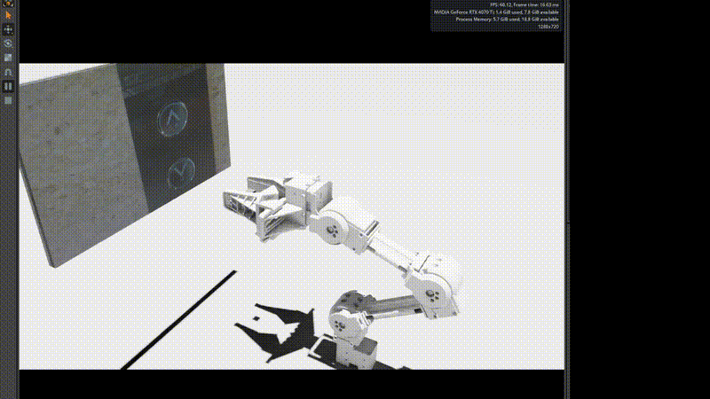
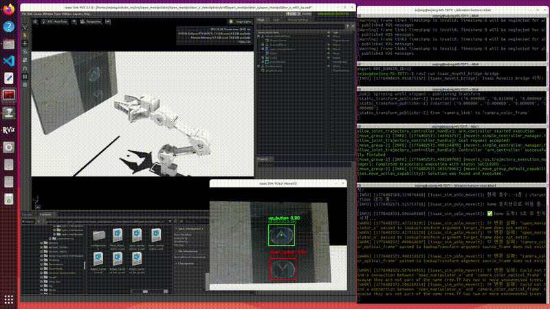
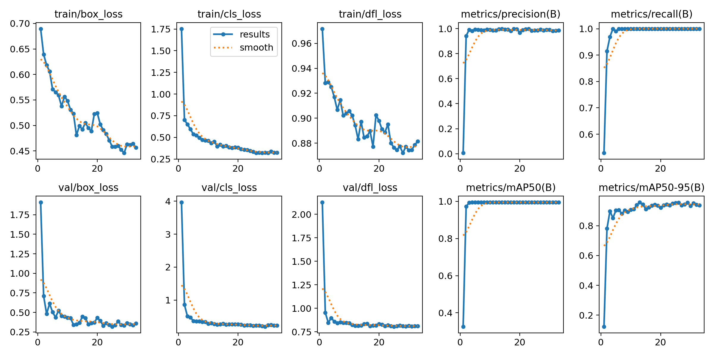
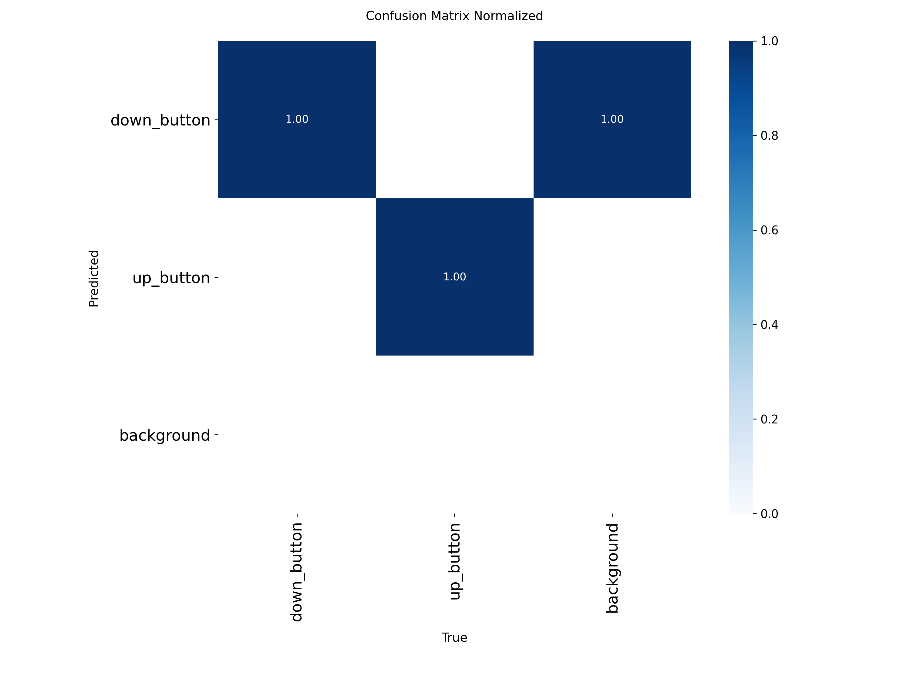
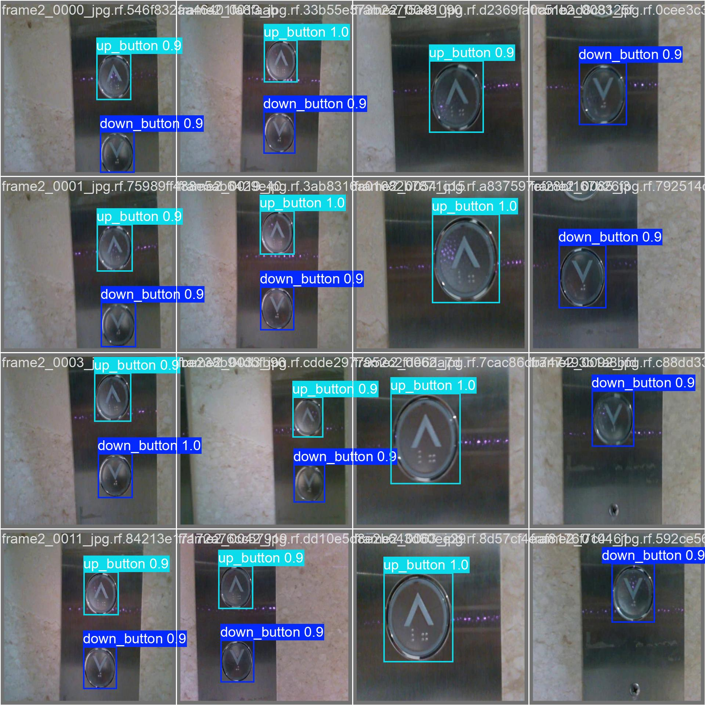

# 자율주행 택배 로봇 - 엘리베이터 버튼 자동 인식 및 조작 시스템

캡스톤디자인 프로젝트 — 자율주행 택배 로봇이 엘리베이터를 스스로 탑승할 수 있도록,
로봇팔이 카메라로 버튼을 인식하고 자동으로 누르는 시스템입니다.

## 시스템 구성

```
택배기사 앱 (층수 입력)
        ↓
자율주행 로봇 (엘리베이터 앞으로 이동)
        ↓
로봇팔 (버튼 인식 → 누르기)  ← 이 저장소
        ↓
엘리베이터 탑승 → 배달 → 복귀
```

## 담당 역할 (로봇팔 시스템)

- **YOLOv8** 으로 UP/DOWN 버튼 실시간 인식
- **YOLO-seg + EasyOCR** 로 숫자 버튼 인식 (층수 자동 매칭)
- **Gemini VLM** 으로 버튼 인식 (YOLO + EasyOCR 대체, zero-shot)
- **D435 RGB-D 카메라** 로 버튼 3D 좌표 추출
- **MoveIt2 IK** 또는 **해석적 IK** 로 관절 각도 계산 (두 가지 방법 모두 지원)
- **PID 제어기** 로 관절 위치 피드백 제어 (시뮬레이션)
- **Isaac Sim** 시뮬레이션으로 전체 흐름 검증

## 데모

### 실제 로봇

<p align="center">
  
  
</p>

### Isaac Sim 시뮬레이션

<p align="center">
  
  
</p>

## 기술 스택

| 분야 | 기술 |
|------|------|
| 로봇 플랫폼 | OpenMANIPULATOR-X |
| 카메라 | Intel RealSense D435 |
| AI/인식 | YOLOv8 (mAP50: 98.7%), YOLO-seg, EasyOCR, Gemini VLM |
| 로봇 미들웨어 | ROS2 Humble, MoveIt2 |
| 시뮬레이션 | Isaac Sim 5.1.0 |
| 언어 | Python 3.10 |

## 주요 흐름 (통합 노드 기준)

```
/target_floor 수신 (목표 층수)
    ↓
[Phase 1 — UP/DOWN]
YOLOv8 → UP 또는 DOWN 버튼 감지
    ↓
Depth → TF 변환 → 해석적 IK → 버튼 누르기
    ↓
홈 복귀 → 엘리베이터 도착 대기 (5초)
    ↓
[Phase 2 — 숫자]
YOLO-seg → 버튼 영역 분할 → EasyOCR → 목표 층수 매칭
    ↓
Depth → TF 변환 → 해석적 IK → 버튼 누르기
    ↓
홈 복귀 → 완료
```

## 파일 구조

```
elevator-button-robot/
├── nodes/
│   ├── real_robot/                        # 실제 로봇용
│   │   ├── real_robot_unified.py          # ★ 통합 노드 YOLO (UP/DOWN → 숫자 전체 시퀀스)
│   │   ├── real_robot_gemini_vlm.py       # ★ 통합 노드 Gemini VLM (YOLO 대체, zero-shot)
│   │   ├── test_gemini_detection.py       # Gemini 인식 단독 테스트 (ROS2 불필요)
│   │   ├── contact_detector.py            # 정지 중 접촉 감지 → 움츠리기 (병렬 실행)
│   │   ├── real_robot_direct_ik.py        # YOLO + 해석적 IK (UP/DOWN 단독)
│   │   ├── real_robot_num_ocr_ik.py       # YOLO-seg + EasyOCR + 해석적 IK (숫자 단독)
│   │   └── real_robot_yolo_moveit.py      # YOLO + MoveIt2 IK (UP/DOWN, 참고용)
│   ├── simulation/                        # Isaac Sim 시뮬레이션용
│   │   ├── isaac_sim_yolo_moveit.py        # YOLO + MoveIt2 IK
│   │   ├── isaac_sim_direct_ik.py          # YOLO + 해석적 IK (MoveIt 불필요)
│   │   ├── pid_joint_controller.py         # PID 관절 제어기 (50Hz)
│   │   ├── isaac_sim_yolo_depth.py         # 뎁스 인식 테스트
│   │   ├── isaac_sim_yolo_tf.py            # TF 변환 테스트
│   │   └── isaac_sim_yolo_test.py          # YOLO 인식 테스트
├── ros2_packages/
│   ├── isaac_moveit_bridge/               # Isaac Sim ↔ MoveIt2 브릿지 패키지
│   └── open_manipulator_patches/          # open_manipulator 커스텀 수정 파일
└── yolo/
    ├── weights/best.pt                    # UP/DOWN 인식 YOLO 모델
    └── dataset/                           # 학습 데이터셋
```

## 실행 방법 (실제 로봇)

U2D2 연결 후 공통으로 먼저 실행:

```bash
# 하드웨어 컨트롤러
ros2 launch open_manipulator_x_bringup hardware.launch.py

# D435 카메라
ros2 launch realsense2_camera rs_launch.py

# 카메라 TF 연결 (link5 기준, 터미널 유지)
ros2 run tf2_ros static_transform_publisher \
    --x 0.12 --y 0.01 --z 0.062 \
    --roll 0.0 --pitch 0.0 --yaw 0.0 \
    --frame-id link5 --child-frame-id camera_link
```

### ★ 방법 D — 통합 노드 YOLO (`real_robot_unified.py`)

YOLOv8 + YOLO-seg + EasyOCR로 버튼을 인식합니다. MoveIt2 없이 동작합니다.

```bash
python3 nodes/real_robot/real_robot_unified.py
ros2 topic pub --once /target_floor std_msgs/Int32 "{data: 3}"
```

---

### ★ 방법 E — 통합 노드 Gemini VLM (`real_robot_gemini_vlm.py`) — **권장 (학습 불필요)**

YOLO/EasyOCR 없이 Gemini Vision API 단일 호출로 UP/DOWN + 숫자 버튼을 인식합니다.
모델 학습 없이 zero-shot으로 동작합니다.

```bash
# 사전 준비
pip install google-genai
export GEMINI_API_KEY="your_key"   # aistudio.google.com/apikey

# 메인 노드
GEMINI_API_KEY="your_key" python3 nodes/real_robot/real_robot_gemini_vlm.py
ros2 topic pub --once /target_floor std_msgs/Int32 "{data: 3}"
```

상태 전이 흐름 (YOLO 노드와 동일):

```
IDLE
 → /target_floor 수신
UPDOWN_READY  : Gemini VLM → UP/DOWN 버튼 인식 (1회 호출)
UPDOWN_PRESS  : 해석적 IK → 버튼 누르기
WAIT          : 홈 복귀 후 엘리베이터 도착 대기 (5초)
NUMBER_READY  : Gemini VLM → 숫자 버튼 인식 (1회 호출)
NUMBER_PRESS  : 해석적 IK → 버튼 누르기
DONE          : 홈 복귀 → IDLE
```

#### Gemini 인식 단독 테스트 (`test_gemini_detection.py`)

ROS2·로봇 없이 카메라 또는 이미지 파일로 인식 결과만 확인할 수 있습니다.

```bash
# 이미지 파일로 테스트
GEMINI_API_KEY="your_key" python3 nodes/real_robot/test_gemini_detection.py --image button.jpg

# 카메라로 테스트 (숫자 버튼 모드)
GEMINI_API_KEY="your_key" python3 nodes/real_robot/test_gemini_detection.py --mode number --floor 3
```

| 키 | 동작 |
|---|---|
| `SPACE` | 즉시 Gemini 호출 |
| `s` | 현재 프레임 저장 |
| `q` | 종료 |

---

### 방법 A — MoveIt2 IK (`real_robot_yolo_moveit.py`)

MoveIt2의 `/compute_ik` 서비스로 관절 각도를 계산합니다.

```bash
# MoveIt2 실행 (방법 A 전용)
ros2 launch open_manipulator_x_moveit_config moveit_core.launch.py

# 메인 노드
python3 nodes/real_robot/real_robot_yolo_moveit.py
```

### 방법 B — 해석적 IK (`real_robot_direct_ik.py`)

수식으로 관절 각도를 직접 계산합니다. MoveIt2 없이 동작합니다.

```bash
# 메인 노드 (MoveIt2 실행 불필요)
python3 nodes/real_robot/real_robot_direct_ik.py
```

수동 테스트 (카메라 없이 특정 좌표로 이동):

```bash
ros2 topic pub --once /target_point geometry_msgs/PointStamped \
    '{header: {frame_id: "world"}, point: {x: 0.25, y: 0.0, z: 0.2}}'
```

### 방법 C — 숫자 버튼 단독 (`real_robot_num_ocr_ik.py`)

YOLO-seg로 버튼 영역을 분할하고 EasyOCR로 숫자를 읽어 목표 층수와 매칭합니다. MoveIt2 없이 동작합니다.

```bash
python3 nodes/real_robot/real_robot_num_ocr_ik.py
```

### 접촉 감지 (`contact_detector.py`) — 병렬 실행

팔이 정지 중일 때 joint effort를 모니터링하다가 사람이 건드리면 joint3·4를 빠르게 접어 움츠러든 뒤 홈으로 복귀합니다. 통합 노드와 함께 별도 터미널에서 실행합니다.

```bash
python3 nodes/real_robot/contact_detector.py
```

- `/robot_status`가 `MOVING`이면 자동으로 감지 중단 (이동 중 오탐 방지)
- 홈 포지션 effort를 시작 시 자동 측정해 baseline으로 사용
- 접촉 판정 시: joint3·4 빠르게 접기(2.0 rad/s) → 2초 유지 → 홈 복귀

> **참고**: `numpy < 2.0.0` 필요. cv_bridge가 NumPy 1.x 기준으로 컴파일되어 있습니다.
> ```bash
> pip install "numpy<2.0.0" --user
> ```

### 실제 로봇 주요 설정

| 항목 | 값 | 설명 |
|---|---|---|
| 카메라 토픽 | `/camera/camera/color/image_raw` | 시뮬레이션과 네임스페이스 다름 |
| 뎁스 인코딩 | `16UC1` → `/1000` | mm → m 변환 |
| 카메라 TF | `link5 → camera_link` | x=0.12, y=0.01, z=0.062 |
| 버튼 오프셋 | `X - 0.05m` | 버튼 표면 5cm 앞에서 멈춤 |
| 베이스 프레임 | `world` | 시뮬레이션은 `open_manipulator_x` |

## 실행 방법 (시뮬레이션)

Isaac Sim 실행 후 Play ▶️ 를 누른 뒤, 공통으로 먼저 실행:

```bash
# Static TF 발행
ros2 launch open_manipulator_x_description isaac_sim_tf.launch.py

# 브릿지 노드 (Isaac Sim ↔ ROS2 관절 토픽 연결)
ros2 run isaac_moveit_bridge bridge
```

### 방법 A — MoveIt2 IK (`isaac_sim_yolo_moveit.py`)

```bash
# MoveIt2 실행
ros2 launch open_manipulator_x_moveit_config moveit_core.launch.py

# PID 제어기 (bridge → /joint_target → PID → /joint_command → Isaac Sim)
python3 nodes/simulation/pid_joint_controller.py

# 메인 노드
python3 nodes/simulation/isaac_sim_yolo_moveit.py
```

### 방법 B — 해석적 IK (`isaac_sim_direct_ik.py`)

MoveIt2와 PID 제어기 없이 동작합니다.

```bash
# 메인 노드 (MoveIt2, PID 실행 불필요)
python3 nodes/simulation/isaac_sim_direct_ik.py
```

수동 테스트 (특정 좌표로 이동):

```bash
ros2 topic pub --once /target_point geometry_msgs/PointStamped \
    '{header: {frame_id: "open_manipulator_x"}, point: {x: 0.25, y: 0.0, z: 0.2}}'
```

## PID 제어기

`nodes/simulation/pid_joint_controller.py`

MoveIt2가 계획한 궤적을 실제 관절 위치 피드백으로 추종합니다.

```
bridge → /joint_target → PID 제어기 → /joint_command → Isaac Sim
                              ↑
                        /joint_states (피드백)
```

| 파라미터 | 값 | 설명 |
|---|---|---|
| 주기 | 50Hz | 제어 루프 주기 |
| Dead band | 0.02 rad | 이 안에 들어오면 보정 중지 |
| Deriv filter | alpha=0.1 | derivative 저역통과 필터 |
| MAX_VELOCITY | 1.0 rad/s | 출력 클램프 |

관절별 게인 (Kp, Ki, Kd):

| 관절 | Kp | Ki | Kd |
|---|---|---|---|
| joint1 (좌우) | 100 | 2.0 | 300 |
| joint2 (어깨) | 100 | 2.0 | 300 |
| joint3 (팔꿈치) | 80 | 1.5 | 200 |
| joint4 (손목) | 60 | 1.0 | 100 |

## 토픽 인터페이스

### 실제 로봇 (real_robot_unified.py)

| 토픽 | 방향 | 타입 | 설명 |
|------|------|------|------|
| `/target_floor` | 입력 | `std_msgs/Int32` | 목표 층수 (음수=지하, 예: -1=B1) |
| `/target_point` | 입력 | `geometry_msgs/PointStamped` | 수동 테스트용 world 좌표 직접 입력 |
| `/robot_status` | 출력 | `std_msgs/String` | `MOVING` / `BUTTON_PRESSED` / `FAILED` |

### 접촉 감지 (contact_detector.py)

| 토픽 | 방향 | 타입 | 설명 |
|------|------|------|------|
| `/robot_status` | 입력 | `std_msgs/String` | 이동 중 여부 확인 (MOVING이면 감지 중단) |
| `/contact_detected` | 출력 | `std_msgs/Bool` | 접촉 감지 시 `true` 발행 |
| `/contact_status` | 출력 | `std_msgs/String` | `CONTACT_DETECTED` / `CONTACT_RESOLVED` |

### 시뮬레이션 전용

| 토픽 | 타입 | 설명 |
|------|------|------|
| `/joint_target` | `sensor_msgs/JointState` | PID 목표 관절 위치 |
| `/joint_command` | `sensor_msgs/JointState` | Isaac Sim 관절 명령 |

### 층수 입력 예시

```bash
# 3층으로 이동 (현재 층보다 위면 up_button 자동 선택)
ros2 topic pub --once /target_floor std_msgs/Int32 "{data: 3}"

# 지하 1층으로 복귀 (down_button 자동 선택)
ros2 topic pub --once /target_floor std_msgs/Int32 "{data: -1}"
```

층수에 따라 UP/DOWN 버튼이 자동 선택됩니다:
- `target_floor > current_floor` → `up_button`
- `target_floor < current_floor` → `down_button`
- 초기 층수: -1 (지하 1층 기준)

## YOLO 학습 결과

<p align="center">
  
  
  
</p>

## 개발 환경

- OS: Ubuntu 22.04
- ROS2: Humble
- Python: 3.10
- Isaac Sim: 5.1.0
