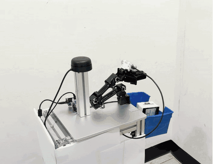
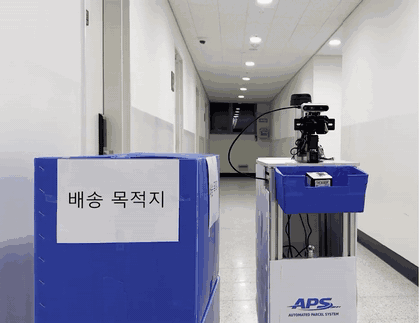
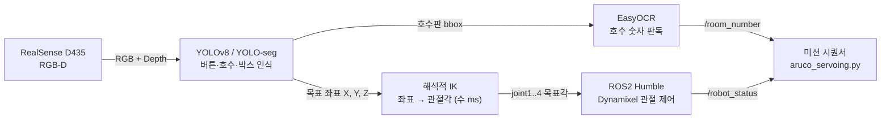
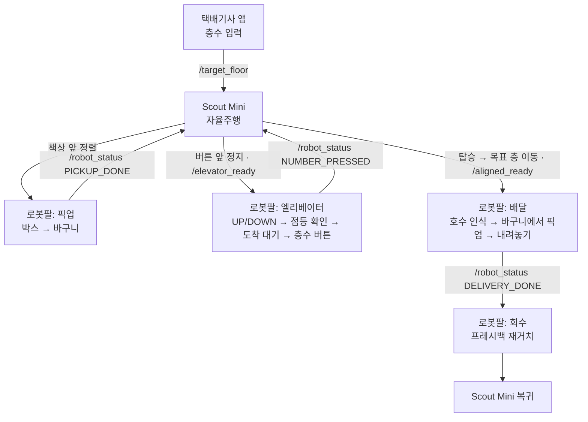
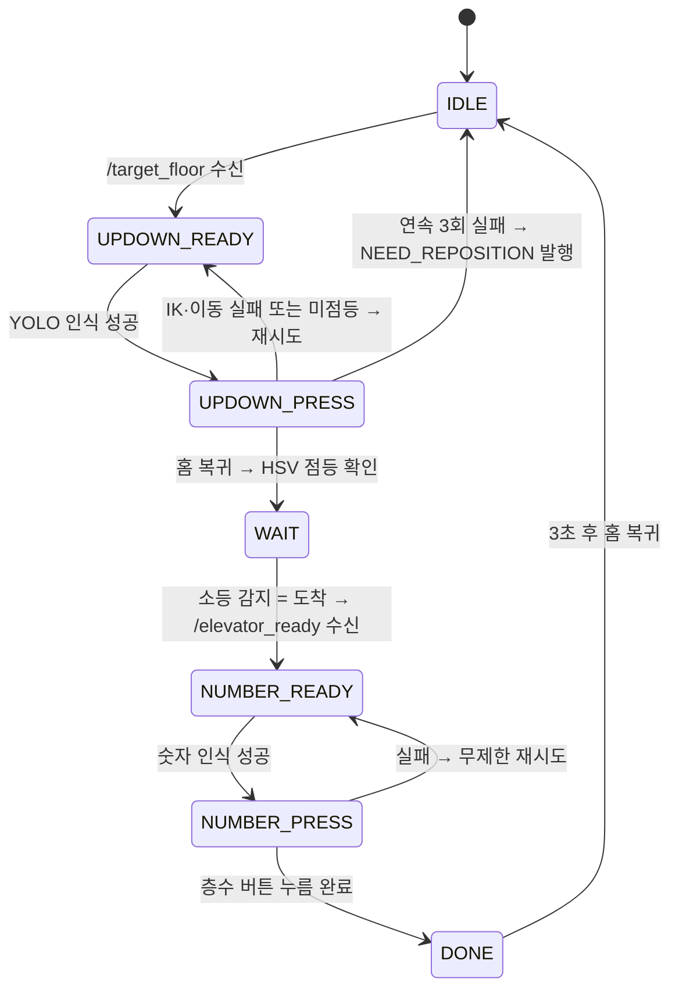
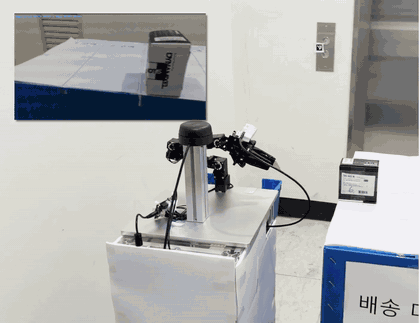
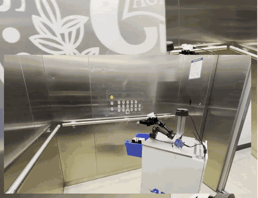
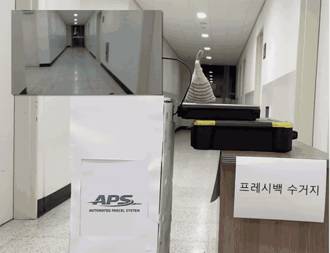

<h1 align="center">🤖 자율주행 택배 로봇 — 로봇팔 제어 시스템</h1>

<p align="center">
  엘리베이터를 스스로 타고 목적지까지 배달하는 자율주행 택배 로봇의 <b>로봇팔(OpenMANIPULATOR-X) 파트</b><br/>
  카메라로 버튼·호수를 인식해 <b>픽업 · 엘리베이터 조작 · 배달 · 회수</b>를 자동 수행합니다.
</p>

<p align="center">
  
  
  
  
  
</p>

<p align="center">
  
  
</p>
<p align="center"><em>좌: 엘리베이터 UP 버튼 인식 → 누름 → 점등 확인 &nbsp;|&nbsp; 우: 바구니에서 박스를 꺼내 목적지로 배달</em></p>

---

## 📋 프로젝트 개요

캡스톤디자인 팀 프로젝트 **"APS (Automated Parcel System)"** — 택배기사가 아파트 입구에 물건을 두면, 자율주행 로봇이 스스로 엘리베이터를 타고 각 세대까지 배달·회수까지 수행합니다. 본 저장소는 그중 **로봇팔 제어 파트**를 담당합니다.

| 파트 | 담당 | 내용 |
|------|------|------|
| **로봇팔** | 이 저장소 | 버튼·호수 인식, 해석적 IK, 픽업/배달/회수 모션 |
| 자율주행 | 팀원 | Scout Mini 주행 · 정렬 (ROS2 토픽으로 연동) |
| 앱/서버 | 팀원 | 층수 입력 HTTPS API |

> **연동 방식**: 각 파트는 ROS2 토픽으로 느슨하게 결합되어 독립 실행됩니다. (아래 **토픽 인터페이스** 참고)

### ✨ 주요 기능

- **🛗 엘리베이터 버튼 조작** — YOLOv8로 UP/DOWN·층수 버튼을 인식하고 해석적 IK로 누름. 버튼 점등(HSV)·소등을 감지해 엘리베이터 도착까지 자동 판단
- **📦 픽업 & 배달** — 책상 위 박스를 바구니로 픽업 → 목적지 책상으로 배달 (14/17스텝, Joint 지령 + XYZ→IK 혼용)
- **🔢 호수 인식** — YOLO + EasyOCR로 호실 번호판을 실시간 읽어 `/room_number` 발행 (지하 B1/B2 포함)
- **🎯 ArUco 비주얼 서보잉** — 마커 기반으로 Scout Mini를 정밀 정렬·구동하고, 픽업→엘리베이터→배달 전 과정을 시퀀싱
- **🧊 프레시백 회수** — 배달 후 보냉백을 다시 팔 고리에 거는 회수 모션
- **🛡 접촉 감지** — 정지 중 사람이 팔을 건드리면 SVM(F1 0.812)이 충돌을 분류해 자동 후퇴

---

## 🙋 내 역할 (My Contribution)

5인 팀 캡스톤 프로젝트에서 **로봇팔 파트 전체를 시뮬레이션 설계부터 실물 구현까지 단독 담당**했습니다. (자율주행 베이스·앱/서버는 팀원 담당, ROS2 토픽으로 연동)

- **해석적 IK 직접 유도·구현** — MoveIt2 플래닝(수 초)이 실시간 버튼 조작에 부적합하다고 판단, 수식을 직접 유도해 수 ms 내 목표 좌표 도달
- **인식 파이프라인 구성** — RealSense D435 뎁스 + YOLOv8/YOLO-seg + EasyOCR로 버튼·호수·박스를 인식하는 노드 설계·구현
- **Isaac Sim 검증 → 실물 적용** — 동작·ROS2 파이프라인을 시뮬레이션에서 먼저 검증한 뒤 실제 OpenMANIPULATOR-X에 이식
- **Sim-to-Real 캘리브레이션** — 뎁스 기반 좌표 오차를 실측으로 찾아내 보정 상수 도출 (아래 **트러블슈팅** 참고)
- **접촉 감지 모델 학습** — FSR 센서 데이터를 수집해 SVM 충돌 분류기 학습 (5-fold CV F1 0.812)

---

## 🔄 시스템 아키텍처

### 센서 → 인식 → 제어 파이프라인


```mermaid
flowchart LR
    RS["RealSense D435<br/>RGB-D"] -->|RGB + Depth| YOLO["YOLOv8 / YOLO-seg<br/>버튼·호수·박스 인식"]
    YOLO -->|호수판 bbox| OCR["EasyOCR<br/>호수 숫자 판독"]
    YOLO -->|목표 좌표 X, Y, Z| IK["해석적 IK<br/>좌표 → 관절각 (수 ms)"]
    IK -->|joint1..4 목표각| CTRL["ROS2 Humble<br/>Dynamixel 관절 제어"]
    OCR -->|"/room_number"| SEQ["미션 시퀀서<br/>aruco_servoing.py"]
    CTRL -->|"/robot_status"| SEQ
```

### 미션 시퀀스 (픽업 → 엘리베이터 → 배달 → 회수)


```mermaid
flowchart TD
    APP["택배기사 앱<br/>층수 입력"] -->|"/target_floor"| SCOUT["Scout Mini<br/>자율주행"]
    SCOUT -->|"책상 앞 정렬"| PICKUP["로봇팔: 픽업<br/>박스 → 바구니"]
    PICKUP -->|"/robot_status PICKUP_DONE"| SCOUT
    SCOUT -->|"버튼 앞 정지 · /elevator_ready"| ELEV["로봇팔: 엘리베이터<br/>UP/DOWN → 점등 확인 → 도착 대기 → 층수 버튼"]
    ELEV -->|"/robot_status NUMBER_PRESSED"| SCOUT
    SCOUT -->|"탑승 → 목표 층 이동 · /aligned_ready"| DELIVER["로봇팔: 배달<br/>호수 인식 → 바구니에서 픽업 → 내려놓기"]
    DELIVER -->|"/robot_status DELIVERY_DONE"| RECOVER["로봇팔: 회수<br/>프레시백 재거치"]
    RECOVER --> SCOUT2["Scout Mini 복귀"]
```

### 엘리베이터 버튼 상태 머신 (`real_robot_unified.py`)


```mermaid
stateDiagram-v2
    [*] --> IDLE
    IDLE --> UPDOWN_READY : /target_floor 수신
    UPDOWN_READY --> UPDOWN_PRESS : YOLO 인식 성공
    UPDOWN_PRESS --> WAIT : 홈 복귀 → HSV 점등 확인
    UPDOWN_PRESS --> UPDOWN_READY : IK·이동 실패 또는 미점등 → 재시도
    UPDOWN_PRESS --> IDLE : 연속 3회 실패 → NEED_REPOSITION 발행
    WAIT --> NUMBER_READY : 소등 감지 = 도착 → /elevator_ready 수신
    NUMBER_READY --> NUMBER_PRESS : 숫자 인식 성공
    NUMBER_PRESS --> NUMBER_READY : 실패 → 무제한 재시도
    NUMBER_PRESS --> DONE : 층수 버튼 누름 완료
    DONE --> IDLE : 3초 후 홈 복귀
```

> UP/DOWN은 `MAX_FAIL=3`에서 Scout Mini에 재정렬을 요청하지만, 숫자 버튼은 이미 엘리베이터에 탑승해 정위치에 있으므로 제한 없이 재시도합니다.

<p align="center">
  
</p>

---

## 🛠 기술 스택

| 분야 | 기술 |
|------|------|
| 로봇 플랫폼 | OpenMANIPULATOR-X (4-DOF) |
| 자율주행 베이스 | Scout Mini |
| 카메라 | Intel RealSense D435 (RGB-D) |
| 버튼/호수/박스 인식 | YOLOv8 · YOLO-seg + EasyOCR (UP/DOWN 버튼 mAP50 98.7%) |
| 정밀 정렬 | ArUco 마커 비주얼 서보잉 (`cv2.aruco`, DICT_4X4_50) |
| 역기구학 | 해석적 IK (수식 직접 유도, MoveIt2 불필요) |
| 접촉 감지 | SVM (RBF 커널, 5-fold CV F1 0.812) |
| 미들웨어 | ROS2 Humble |
| 시뮬레이션 | Isaac Sim 5.1.0 |
| 언어 | Python 3.10 |

---

## 🎬 데모

실제 건물에서 촬영한 전체 미션입니다. 순서대로 이어집니다.

<p align="center">
  
  
  
</p>
<p align="center">
  <em>① <b>픽업</b> — 대기함 박스를 집어 바구니로&nbsp;&nbsp;|&nbsp;&nbsp;
  ② <b>UP 버튼</b> — 인식 → 누름 → 점등 확인&nbsp;&nbsp;|&nbsp;&nbsp;
  ③ <b>층수 버튼</b> — 엘리베이터 내부 패널</em>
</p>

<p align="center">
  
  
</p>
<p align="center">
  <em>④ <b>배달</b> — 바구니에서 박스를 꺼내 목적지로&nbsp;&nbsp;|&nbsp;&nbsp;
  ⑤ <b>프레시백 회수</b> — 보냉백 손잡이를 잡아 재거치</em>
</p>

> 좌상단 작은 화면은 로봇팔 카메라 시점입니다. ②에서 버튼이 초록으로 점등되는 순간, ⑤에서 손잡이를 검출하는 장면을 확인할 수 있습니다.

<p align="center">
  
  
</p>
<p align="center"><em>Isaac Sim 시뮬레이션 — 실물 이식 전 동작·ROS2 파이프라인 검증</em></p>

---

## 🧠 핵심 기술 포인트 (차별점)

### 1. 해석적 IK (Analytical Inverse Kinematics) — 왜 MoveIt2 대신 직접 구현했는가

엘리베이터 버튼 조작은 인식 → 좌표 계산 → 접근 → 접촉이 짧은 주기로 반복되는 실시간 태스크입니다. MoveIt2의 샘플링 기반 플래닝은 매 호출마다 충돌 검사·경로 탐색을 거쳐 수 초가 걸려, 버튼 하나 누르는 데도 지연이 누적되는 문제가 있었습니다. 4-DOF라는 제한된 자유도 덕분에 목표 자세(수평 접근)까지 포함한 닫힌 형태 해가 존재한다고 판단해, MoveIt2 없이 수식을 직접 유도했습니다. 좌표 입력 → 관절각 계산이 수 ms 내에 끝나 실시간 제어 루프에 바로 사용할 수 있고, elbow-up/elbow-down 두 해를 모두 계산해 관절 한계를 통과하는 해를 선택하는 방식으로 특이점 근처에서도 안정적으로 동작합니다.

<details>
<summary><b>📐 수식 유도 펼치기</b></summary>

#### 링크 파라미터

| 기호 | 값 | 설명 |
|------|-----|------|
| $L_1$ | 0.0595 m | base → joint2 (수직) |
| $L_2$ | $\sqrt{0.024^2 + 0.128^2} \approx 0.1302$ m | joint2 → joint3 유효 길이 |
| $\alpha$ | $\text{atan2}(0.128,\ 0.024) \approx 79.4°$ | link2 수평 기준각 |
| $L_3$ | 0.124 m | joint3 → joint4 |
| $L_4$ | 0.126 m | joint4 → end-effector |

목표 위치 $(X, Y, Z)$ 가 주어졌을 때:

**① θ₁ — 베이스 회전**

$$\theta_1 = \text{atan2}(Y,\ X)$$

**② 손목 위치 계산** (end-effector에서 $L_4$ 제거)

$$r_w = \sqrt{X^2 + Y^2} - L_4, \qquad z_w = Z$$
$$d_r = r_w, \quad d_z = z_w - L_1, \quad D = \sqrt{d_r^2 + d_z^2}$$

**③ 코사인 법칙** → ψ (L₂, L₃ 사이각, 두 해: elbow-up / elbow-down)

$$\cos\psi = \frac{D^2 - L_2^2 - L_3^2}{2 L_2 L_3}, \qquad \psi = \pm\arccos(\cos\psi)$$

**④ θ₂, θ₃**

$$\gamma = \text{atan2}(L_3 \sin\psi,\ L_2 + L_3 \cos\psi)$$
$$\theta_2 = \alpha - \bigl(\text{atan2}(d_z,\ d_r) - \gamma\bigr), \qquad \theta_3 = -\psi - \alpha$$

**⑤ θ₄ — 수평 접근 구속 조건** (end-effector가 버튼에 수평으로 접근)

$$\theta_4 = -(\theta_2 + \theta_3)$$

elbow-up / elbow-down 두 해를 모두 계산한 뒤, 관절 한계를 통과하는 첫 번째 해를 사용합니다.

</details>

### 2. YOLOv8 버튼 인식 — UP/DOWN mAP50 **98.7%**

UP/DOWN 버튼은 YOLOv8, 층수 버튼은 YOLO-seg로 영역을 분할한 뒤 EasyOCR로 숫자를 읽습니다. 학습된 가중치가 레포에 포함되어 **추가 학습 없이 바로 실행** 가능합니다.

<p align="center">
  
  
  
</p>

| 가중치 | 용도 |
|--------|------|
| `best.pt` | UP/DOWN 버튼 (mAP50 98.7%) |
| `best_num.pt` | 층수 버튼 영역 분할 |
| `best_room.pt` | 호실 번호판 |
| `best_handle.pt` | 프레시백 손잡이 |
| `best_box.pt` | 배달 박스 |

### 3. SVM 접촉 감지 — F1 **0.812**

FSR406 센서로 수집한 실측 데이터(총 19,664 슬라이딩 윈도우)로 학습한 SVM(RBF 커널)이 정지 중 외부 접촉을 분류합니다. 단순 effort threshold 대비 오인식이 크게 줄었습니다.

- **특징 벡터 (160차원)**: 최근 10샘플 × (joint velocity 4 + effort_delta 4 + 프레임 간 diff 8)
- **학습 결과**: 5-fold CV F1 **0.812 ± 0.006** (sklearn, StandardScaler 정규화)
- **오인식 방지**: 버튼 누르는 중(`MOVING`)·홈 복귀 6초간 감지 차단, 연속 2윈도우 × prob ≥ 0.70 일 때만 접촉 확정
- 데이터 수집은 `fsr_effort_logger.py`, 학습된 모델은 `svm_collision_model.pkl` 로 포함

### 4. ArUco 비주얼 서보잉 + 미션 시퀀서

`aruco_servoing.py`는 ArUco 마커(DICT_4X4_50)를 추종해 Scout Mini를 목표 거리(target_z ≈ 0.26 m)·정렬로 구동(`/cmd_vel`)하고, **픽업 → 엘리베이터 → 배달** 전 단계를 토픽으로 오케스트레이션합니다. 시연 영상은 `~/recordings/` 에 자동 저장됩니다.

---

## 🩹 트러블슈팅 — Sim-to-Real 간극

**증상**: Isaac Sim에서 검증한 로직을 실물에 그대로 적용하자, RealSense 뎁스 값을 기준으로 계산한 목표 좌표로 이동했을 때 실제 버튼 위치와 미세하게 어긋나는 현상이 발생했습니다. 시뮬레이션은 뎁스 값이 이상적이지만, 실물 카메라는 정렬(align) 오차·마운트 위치 오차 등으로 계산된 Z 좌표가 실제보다 체계적으로 높게 나왔습니다.

**진행 과정**:
1. Isaac Sim에서는 문제없이 동작 확인 → 실물 이식 후 접촉 실패/오차 재현
2. 카메라 해상도를 1920×1080으로 올리고 `aligned_depth_to_color` 토픽으로 전환하는 과정에서 좌표 오차가 더 뚜렷이 드러남 (`ba998ba` 커밋)
3. 여러 번 접촉 시도를 반복하며 목표 Z와 실제 접촉 지점의 차이를 실측
4. 오차가 일정한 방향(항상 더 높게 감지)으로 나타남을 확인 → **고정 보정 상수**로 처리 가능하다고 판단
5. `arm_elevator.py` / `real_robot_unified.py`의 목표 Z 계산에 **`Z − 0.031 m`** 보정을 적용해 안정화

```python
# nodes/real_robot/arm_elevator.py, real_robot_unified.py
args=(X, Y, Z - 0.031, cls)   # 카메라로 계산한 Z에서 0.031m 보정
```

> 설치 위치(카메라 마운트 각도·높이)가 바뀌면 오차 방향/크기도 달라질 수 있어 재실측이 필요합니다. 이 상수는 현재 카메라 장착 위치(`link5` 기준 TF)에 한정된 값입니다.

---

## ⚙️ 설치

### 요구 사항
- Ubuntu 22.04 + ROS2 Humble · Python 3.10
- OpenMANIPULATOR-X + U2D2 · Intel RealSense D435 (실제 로봇)

### 1. 이 레포 클론

```bash
git clone https://github.com/uihyeong/elevator-button-robot.git
cd elevator-button-robot
pip install -r requirements.txt
```

> **주의**: `numpy < 2.0.0` 필요. cv_bridge가 NumPy 1.x 기준으로 컴파일되어 있습니다.

### 2. colcon_ws — ROS2 하드웨어 패키지 빌드

```bash
# 의존 패키지 설치
sudo apt install \
  ros-humble-ros2-control ros-humble-moveit* \
  ros-humble-gazebo-ros2-control ros-humble-ros2-controllers \
  ros-humble-controller-manager ros-humble-position-controllers \
  ros-humble-joint-state-broadcaster ros-humble-joint-trajectory-controller \
  ros-humble-gripper-controllers ros-humble-hardware-interface ros-humble-xacro

# open_manipulator 소스 빌드
mkdir -p ~/colcon_ws/src && cd ~/colcon_ws/src
git clone -b humble https://github.com/ROBOTIS-GIT/DynamixelSDK.git
git clone -b humble https://github.com/ROBOTIS-GIT/open_manipulator.git
git clone -b humble https://github.com/ROBOTIS-GIT/dynamixel_hardware_interface.git
git clone -b humble https://github.com/ROBOTIS-GIT/dynamixel_interfaces.git
cd ~/colcon_ws && colcon build --symlink-install

# ROS 환경 + RealSense 드라이버
echo 'source /usr/share/gazebo/setup.sh'              >> ~/.bashrc
echo 'source ~/colcon_ws/install/local_setup.bash'    >> ~/.bashrc
source ~/.bashrc
sudo apt install ros-humble-realsense2-camera
```

> 전체 설치 가이드(U2D2 통신 설정 등): [ROBOTIS Docs — OpenMANIPULATOR-X Quick Start](https://docs.robotis.com/docs/systems/openmanipulator_x/quick_start_guide/)

### 3. open_manipulator_patches 적용 (선택)

MoveIt2 노드 또는 Isaac Sim 시뮬레이션 사용 시에만 필요합니다 → [적용 방법](ros2_packages/open_manipulator_patches/README.md)

---

## ▶️ 실행 방법 (실제 로봇)

### 공통 준비

U2D2 연결 후 아래 3개 터미널을 먼저 실행합니다.

```bash
# 터미널 1 — 하드웨어 컨트롤러
ros2 launch open_manipulator_x_bringup hardware.launch.py

# 터미널 2 — D435 카메라 (정렬 뎁스 + 1080p)
ros2 launch realsense2_camera rs_launch.py \
  rgb_camera.color_profile:=1920,1080,30 align_depth.enable:=true

# 터미널 3 — 카메라 TF (유지)
ros2 run tf2_ros static_transform_publisher \
  --x 0.12 --y 0.01 --z 0.062 --roll 0.0 --pitch 0.0 --yaw 0.0 \
  --frame-id link5 --child-frame-id camera_link
```

### 📦 픽업 / 배달 (`arm_delivery.py`)

```bash
python3 nodes/real_robot/arm_delivery.py

ros2 topic pub --once /start_pickup   std_msgs/Bool "{data: true}"   # 픽업 시작
ros2 topic pub --once /aligned_ready  std_msgs/Bool "{data: true}"   # 목적지 정렬 완료 → 배달
```

단독 테스트: `real_robot_delivery.py`(자동, 1.5초 간격) / `test_delivery_motion.py`(Enter로 스텝별)

> ▶ 동작 영상: [데모 ① 픽업 · ④ 배달](#-데모)

<details>
<summary><b>📋 픽업(14)/배달(17) 스텝 & 웨이포인트 상수</b></summary>

각 스텝은 **Joint 직접 지령**(절대 관절각)과 **XYZ→IK**(좌표 입력, IK가 관절각 자동 계산)를 혼용합니다. 위치가 바뀔 때: Joint 스텝은 재실측 필요, XYZ 스텝은 좌표값만 수정. (`arm_delivery.py`의 `PICKUP_STEPS` / `DELIVER_STEPS` 기준)

**픽업 (14스텝)**

| # | 동작 | 방식 |
|---|------|------|
| 1 | 홈 | Joint `HOME_JOINTS` |
| 2 | 책상 방향 + YOLO 박스 확인 | Joint `TABLE_LOOK_JOINTS` |
| 3 | YOLO 박스 인식 대기 | YOLO (1.5초) |
| 4 | 그리퍼 열기 (접근 전) | Gripper `OPEN` |
| 5 | 박스 위 호버 | XYZ `TABLE_HOVER` |
| 6 | 박스 잡기 위치 | XYZ `TABLE_GRIP` |
| 7 | 그리퍼 닫기 (잡기) | Gripper `CLOSE` |
| 8 | 바구니에 내려놓기 | Joint `BASKET_PLACE_JOINTS` |
| 9 | 홈 복귀 | Joint `HOME_JOINTS` |
| 10 | 바구니 확인 | Joint `BASKET_LOOK_JOINTS` |
| 11 | 바구니 박스 잡기 | Joint `BASKET_GRIP_JOINTS` |
| 12 | 그리퍼 열기 (박스 놓기) | Gripper `OPEN` |
| 13 | 엘리베이터 홈 복귀 | Joint `ELEVATOR_HOME_JOINTS` |
| 14 | 그리퍼 닫기 (대기 자세) | Gripper `ELEVATOR` |

**배달 (17스텝)**

| # | 동작 | 방식 |
|---|------|------|
| 1 | 호수 확인 (OCR) | Joint `ROOM_SIGN_JOINTS` |
| 2 | 홈 | Joint `HOME_JOINTS` |
| 3 | 바구니 확인 (joint4 틸트) | Joint `BASKET_LOOK_JOINTS` |
| 4 | YOLO 박스 인식 대기 | YOLO (1.5초) |
| 5 | 그리퍼 열기 (접근 전) | Gripper `OPEN` |
| 6 | 바구니 박스 잡기 | Joint `BASKET_GRIP_JOINTS` |
| 7 | 그리퍼 닫기 (잡기) | Gripper `CLOSE` |
| 8 | 바구니 확인 (잡기 후) | Joint `BASKET_LOOK_JOINTS` |
| 9 | 박스 들어올리기 | XYZ `BASKET_HOVER` |
| 10 | 목적지 방향 확인 | Joint `TABLE_LOOK_JOINTS` |
| 11 | 목적지 책상 위 호버 | XYZ `DEST_HOVER` |
| 12 | 목적지에 내려놓기 | XYZ `DEST_PLACE` |
| 13 | 그리퍼 열기 (박스 놓기) | Gripper `OPEN` |
| 14 | 위로 호버 | XYZ `DEST_HOVER_HIGH` |
| 15 | 목적지 방향 확인 | Joint `TABLE_LOOK_JOINTS` |
| 16 | 엘리베이터 홈 복귀 | Joint `ELEVATOR_HOME_JOINTS` |
| 17 | 그리퍼 닫기 (대기 자세) | Gripper `ELEVATOR` |

**Joint 직접 지령** — 절대 관절각 [rad], 위치 바뀌면 재실측 필요

| 상수 | joint1 | joint2 | joint3 | joint4 | 용도 |
|------|--------|--------|--------|--------|------|
| `HOME_JOINTS` | 3.141 | -1.3963 | 1.2217 | 0.5236 | 홈 포지션 |
| `TABLE_LOOK_JOINTS` | 1.571 | -1.3963 | 1.2217 | 0.5236 | 책상·목적지 방향 확인 |
| `BASKET_LOOK_JOINTS` | -3.116 | -0.387 | 0.755 | 1.164 | 바구니 확인 (배달) |
| `BASKET_PLACE_JOINTS` | 3.1032 | 0.00767 | 1.41126 | -1.41433 | 바구니에 내려놓기 (픽업) |
| `BASKET_GRIP_JOINTS` | 3.122 | 0.457 | 0.831 | 0.305 | 바구니 박스 잡기 (배달) |
| `ROOM_SIGN_JOINTS` | 1.571 | -2.0203 | 1.5002 | -0.044 | 호수 번호판 인식 (배달 1번 스텝) |
| `ELEVATOR_HOME_JOINTS` | 3.1400 | -1.9190 | 1.2701 | 0.7240 | 엘리베이터 홈 (대기 자세) |

**그리퍼** — `OPEN=0.020` · `CLOSE=0.006`(살살 잡기) · `ELEVATOR=-0.007`(주행 대기)

**XYZ → IK** — world 프레임 좌표 [m], 좌표값만 수정하면 IK가 관절각 자동 계산

| 상수 | X | Y | Z | 용도 |
|------|---|---|---|------|
| `TABLE_HOVER` | 0.013 | 0.360 | 0.100 | 박스 위 호버 (픽업) |
| `TABLE_GRIP` | 0.013 | 0.360 | 0.040 | 박스 잡기 위치 (픽업) |
| `BASKET_HOVER` | -0.165 | 0.009 | 0.123 | 박스 들어올리기 (배달) |
| `DEST_HOVER` | 0.013 | 0.360 | 0.100 | 목적지 호버 (배달) |
| `DEST_HOVER_HIGH` | 0.013 | 0.360 | 0.115 | 위로 호버 +1.5cm (배달) |
| `DEST_PLACE` | 0.013 | 0.360 | 0.040 | 목적지에 내려놓기 (배달) |

</details>

### 🛗 엘리베이터 버튼 (`arm_elevator.py`)

```bash
python3 nodes/real_robot/arm_elevator.py

ros2 topic pub --once /target_floor   std_msgs/Int32 "{data: -2}"   # 층수 입력 (B2)
ros2 topic pub --once /elevator_ready std_msgs/Bool  "{data: true}" # 탑승 완료 신호(테스트용)
```

단독 테스트: `real_robot_unified.py` (동일 토픽)

> ▶ 동작 영상: [데모 ② UP 버튼 · ③ 층수 버튼](#-데모)

> **버튼 Z 보정**: `Z − 0.031 m` — 카메라 TF z=0.062가 실제보다 높게 감지되는 오차 보정값. 설치 위치가 바뀌면 재실측 필요. (배경은 위 **트러블슈팅** 참고)

### 🔢 호수 인식 (`detect_room_sign.py`) · 🧊 프레시백 회수 (`arm_recover.py`)

```bash
# 호수 번호판 인식 → /room_number 발행
python3 nodes/real_robot/detect_room_sign.py

# 프레시백 회수 (배달 후 보냉백 재거치)
python3 nodes/real_robot/arm_recover.py
ros2 topic pub --once /start_recover std_msgs/Bool "{data: true}"
```

> ▶ 동작 영상: [데모 ⑤ 프레시백 회수](#-데모)

### 🎯 ArUco 서보잉 미션 (`aruco_servoing.py`)

```bash
python3 nodes/real_robot/aruco_servoing.py
ros2 topic pub --once /mission_floor std_msgs/Int32 "{data: 5}"
ros2 topic pub --once /start_pickup  std_msgs/Bool  "{data: true}"
```

### 🛡 접촉 감지 (선택, 병렬 실행)

```bash
python3 nodes/real_robot/contact_detector_svm.py   # SVM 방식 (권장, F1 0.812)
python3 nodes/real_robot/contact_detector.py       # Effort threshold 방식 (단순)
```

`/robot_status`가 `MOVING`이면 자동으로 모니터링이 중단됩니다.

---

## 🧪 실행 방법 (Isaac Sim 시뮬레이션)

Isaac Sim 실행 후 Play ▶️ 를 누른 뒤:

```bash
ros2 launch open_manipulator_x_description isaac_sim_tf.launch.py   # Static TF
ros2 run isaac_moveit_bridge bridge                                 # Isaac ↔ ROS2 브릿지
python3 nodes/simulation/isaac_sim_direct_ik.py                     # 메인 (해석적 IK)
```

MoveIt2 사용 시:

```bash
ros2 launch open_manipulator_x_moveit_config moveit_core.launch.py
python3 nodes/simulation/pid_joint_controller.py
python3 nodes/simulation/isaac_sim_yolo_moveit.py
```

---

## 📊 결과 (Results)

| 지표 | 값 | 근거 |
|------|-----|------|
| 배송 작업 시간 단축 | **82%↓** (기사 직접 배송 대비) | 실제 건물(지하 1층 → 5층) 실측 로그 · 캡스톤 발표자료 (레포 외부 기록) |
| UP/DOWN 버튼 인식 mAP50 | **98.7%** | `yolo/results/` 학습 로그 (레포 포함) |
| 접촉 감지 SVM F1 | **0.812 ± 0.006** (5-fold CV) | FSR 실측 데이터 19,664 윈도우 — 학습된 모델만 레포 포함 |
| IK 연산 시간 | 수 ms 수준 (MoveIt2 대비 수 초 → 대폭 단축) | 해석적 IK — 플래닝 없이 닫힌 형태 해 계산 |

> ⚠️ **재현 범위**: 레포 안에서 직접 확인 가능한 지표는 **mAP50**(`yolo/results/`)뿐입니다.
> 작업 시간 82% 단축은 실측 시간 기록·시연 로그·캡스톤 보고서를 근거로 하며 원본 데이터는 레포에 없습니다.
> SVM F1도 학습된 모델(`svm_collision_model.pkl`)만 포함되어 있고, FSR 원본 로그와 학습 스크립트는 포함되어 있지 않습니다.

---

## 📁 파일 구조

```
elevator-button-robot/
├── nodes/
│   ├── real_robot/
│   │   ├── arm_elevator.py            # 🛗 엘리베이터 버튼 (팀 통합, 토픽 트리거)
│   │   ├── arm_delivery.py            # 📦 픽업/배달 (팀 통합, 토픽 트리거)
│   │   ├── arm_recover.py             # 🧊 프레시백 회수
│   │   ├── detect_room_sign.py        # 🔢 호수 번호판 인식 → /room_number
│   │   ├── aruco_servoing.py          # 🎯 ArUco 비주얼 서보잉 + 미션 시퀀서
│   │   ├── scout.py                   # Scout Mini 통합 뼈대
│   │   ├── real_robot_unified.py      # 엘리베이터 버튼 — 단독 테스트
│   │   ├── real_robot_delivery.py     # 픽업/배달 자동 — 단독 테스트
│   │   ├── test_delivery_motion.py    # 픽업/배달 수동 데모 (Enter 진행)
│   │   ├── test_button_lit.py         # 버튼 점등 HSV 튜닝 도구
│   │   ├── contact_detector_svm.py    # 🛡 접촉 감지 — SVM (권장)
│   │   ├── contact_detector.py        # 접촉 감지 — Effort threshold
│   │   ├── fsr_effort_logger.py       # FSR + effort 로깅 (학습 데이터 수집)
│   │   ├── svm_collision_model.pkl    # 학습된 SVM 모델
│   │   └── delivery_mission.launch.py # 배달 미션 런치
│   └── simulation/
│       ├── isaac_sim_direct_ik.py     # YOLO + 해석적 IK
│       ├── isaac_sim_yolo_moveit.py   # YOLO + MoveIt2
│       ├── pid_joint_controller.py    # PID 관절 제어기 (50Hz)
│       ├── setup_mobile_manipulator.py# Scout Mini + 로봇팔 합체 씬
│       └── attach_frame_to_scout.py   # 프레임 고정 스크립트
├── ros2_packages/
│   ├── isaac_moveit_bridge/           # Isaac Sim ↔ ROS2 브릿지 패키지
│   ├── open_manipulator_patches/      # open_manipulator 커스텀 수정 파일
│   └── elevator_robot/                # ROS2 패키지화 버전 (ros2 run)
├── yolo/
│   ├── weights/                       # best.pt · best_num.pt · best_room.pt · best_handle.pt · best_box.pt
│   ├── train_box.py                   # 박스 모델 학습 스크립트
│   ├── dataset/  · datasets/          # 학습 데이터셋
│   └── results/                       # 학습 결과 그래프
├── media/                             # 데모 GIF · 블록 다이어그램
├── requirements.txt
└── LICENSE
```

---

## 🔌 토픽 인터페이스

### 로봇팔 ↔ Scout Mini

| 토픽 | 방향 | 타입 | 설명 |
|------|------|------|------|
| `/target_floor` | Scout → 팔 | `Int32` | 목표 층수 (음수=지하, 예: -1=B1) |
| `/elevator_ready` | Scout → 팔 | `Bool` | 버튼 앞 정지 완료 → 층수 버튼 Phase 시작 |
| `/aligned_ready` | Scout → 팔 | `Bool` | 호실 앞 정렬 완료 → 배달 시작 |
| `/start_pickup` · `/start_delivery` · `/start_recover` | Scout → 팔 | `Bool` | 픽업 / 배달 / 회수 트리거 |
| `/robot_status` | 팔 → Scout | `String` | 상태값 (아래 참고) |
| `/room_number` | 팔 → Scout | `String` | 인식된 호수 (예: `"531"`) |
| `/pickup_done` · `/delivery_done` · `/recover_done` | 팔 → Scout | `Bool` | 각 단계 완료 |

### 미션 / 내부 토픽

| 토픽 | 타입 | 설명 |
|------|------|------|
| `/cmd_vel` | `Twist` | ArUco 서보잉이 Scout Mini를 구동 (`aruco_servoing.py`) |
| `/mission_floor` | `Int32` | 미션 시퀀서에 목표 층 전달 |
| `/target_point` | `PointStamped` | 수동 테스트용 world 좌표 직접 입력 |
| `/contact_detected` | `Bool` | 접촉 감지 신호 |
| `/contact_status` | `String` | `CONTACT_DETECTED` / `CONTACT_RESOLVED` |

### `/robot_status` 상태값

| 값 | 발행 노드 | 의미 |
|---|---|---|
| `MOVING` | 전체 | 관절 이동 중 |
| `UPDOWN_PRESSED` | elevator | UP/DOWN 버튼 **점등 확인** 완료 (누르기 직후가 아님) |
| `BUTTON_PRESSED` | elevator(단독) | 층수 버튼 누름 완료 — `arm_elevator.py`의 `NUMBER_PRESSED`에 해당 |
| `ELEVATOR_ARRIVED` | elevator | 버튼 소등 감지 (엘리베이터 도착) |
| `NUMBER_PRESSED` | elevator | 층수 버튼 누름 완료 |
| `NEED_REPOSITION` | elevator | UP/DOWN 연속 3회 실패 → Scout 재정렬 요청 |
| `PICKUP_DONE` / `DELIVERY_DONE` | delivery | 픽업 / 배달 완료 |
| `RECOVER_DONE` | recover | 프레시백 회수 완료 |
| `FAILED` | 전체 | 오류 |

---

## 📐 부록 — 관절 포지션 레퍼런스

엘리베이터 노드(`arm_elevator.py`) 기준:

| 상수 | joint1 | joint2 | joint3 | joint4 | 용도 |
|------|--------|--------|--------|--------|------|
| `HOME_JOINTS` | 3.1400 | -1.9190 | 1.2701 | 0.7240 | 기본 홈 자세 |
| `NUMBER_HOME_JOINTS` | 3.1400 | -1.9190 | 1.2701 | 0.7240 | 소등 후 숫자 패널 대기 |

호수 인식 노드(`detect_room_sign.py` · `arm_recover.py`) 기준:

| 상수 | joint1 | joint2 | joint3 | joint4 | 용도 |
|------|--------|--------|--------|--------|------|
| `ROOM_SIGN_JOINTS` | 1.571 | -2.0203 | 1.5002 | -0.044 | 호수 번호판 인식 (라이다 미간섭) |

> 단독 테스트 노드(`real_robot_unified.py`)는 홈 자세가 `-3.141, -0.9948, 0.6981, 0.2967` 로 다릅니다.
> 픽업/배달용 웨이포인트 상수는 위 **픽업 / 배달** 섹션의 접이식 표 참고.

---

## 🌐 개발 환경

`Ubuntu 22.04` · `ROS2 Humble` · `Python 3.10` · `Isaac Sim 5.1.0`

## 📄 라이선스

[MIT License](LICENSE)
