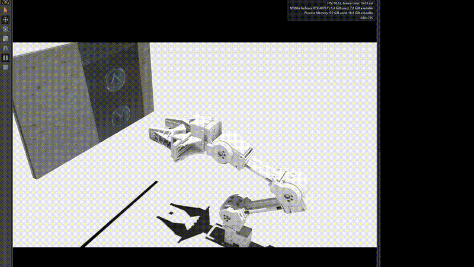
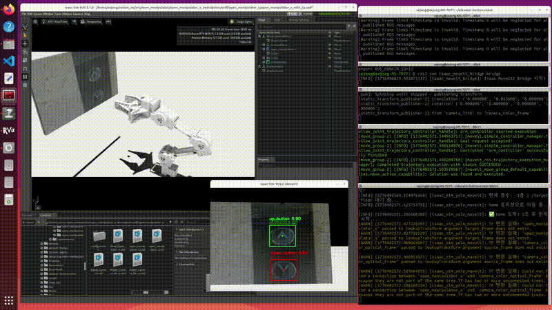
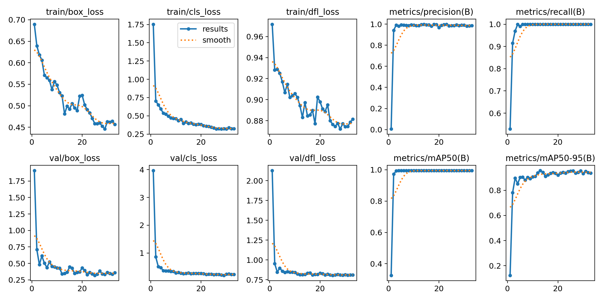
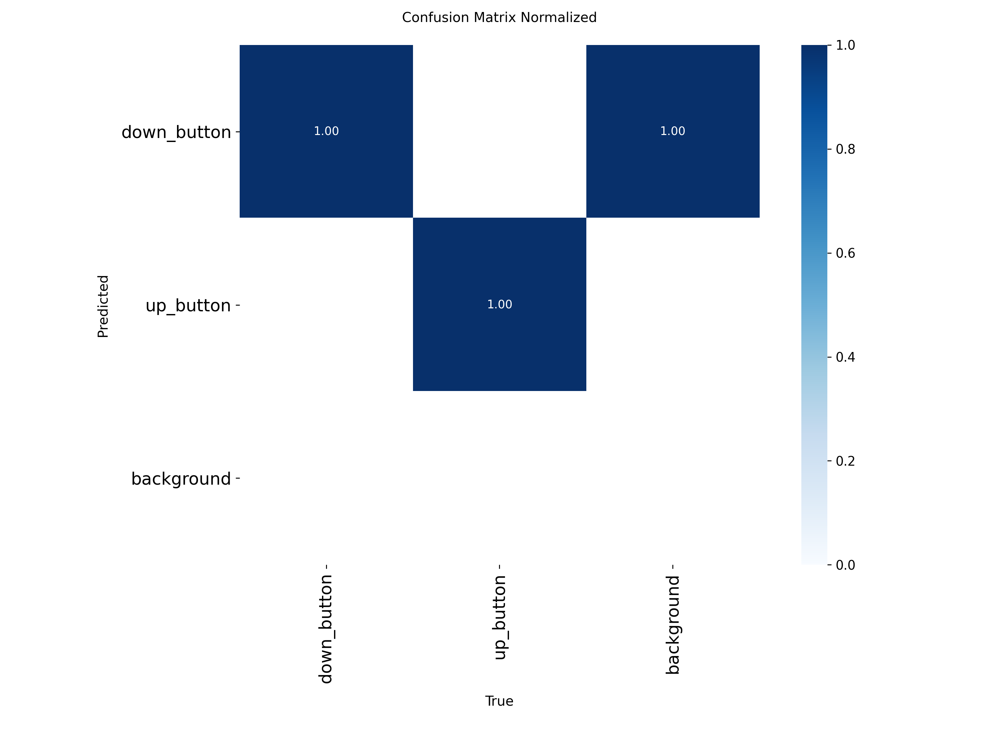
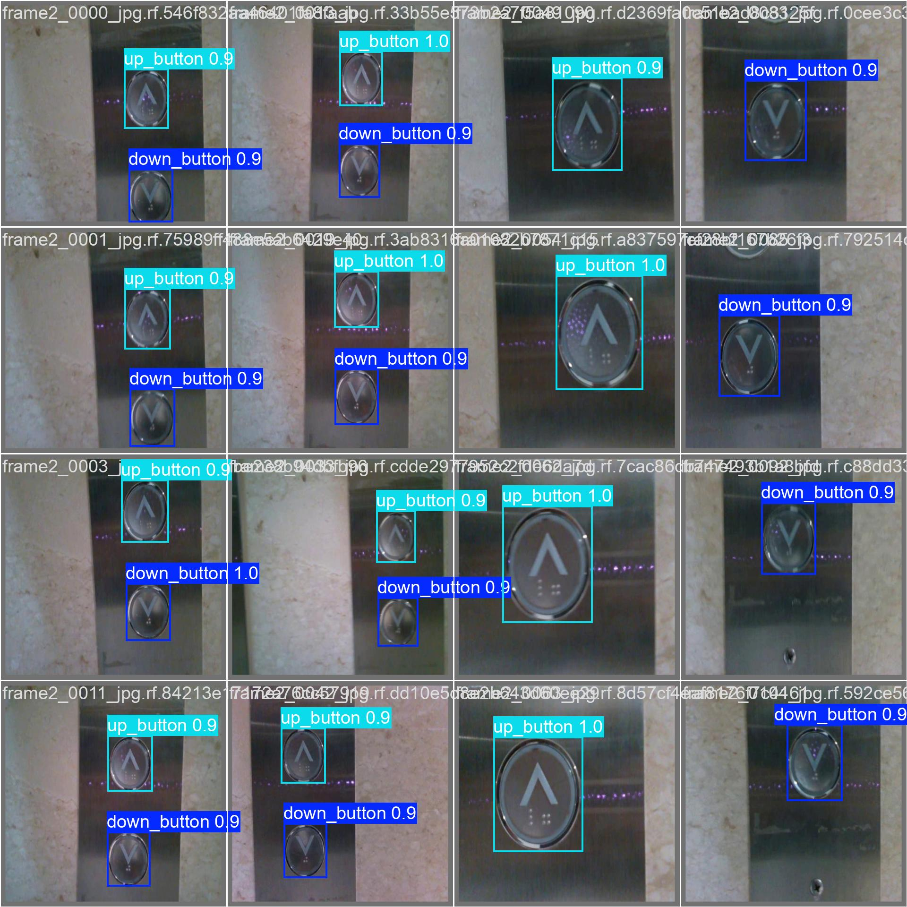

# 자율주행 택배 로봇 — 엘리베이터 버튼 자동 인식 및 조작 시스템

캡스톤디자인 프로젝트 — 자율주행 택배 로봇이 엘리베이터를 스스로 탑승할 수 있도록,  
로봇팔이 카메라로 버튼을 인식하고 자동으로 누르는 시스템입니다.

## 시스템 구성

```
택배기사 앱 (층수 입력)
        ↓  ROS2 /target_floor
자율주행 로봇 Scout Mini (엘리베이터 앞으로 이동)
        ↓  ROS2 /target_floor
로봇팔 OpenMANIPULATOR-X  ← 이 저장소
  ├─ UP/DOWN 버튼 인식 → 누르기
  ├─ 버튼 점등 확인 → 소등(엘리베이터 도착) 대기
  └─ 층수 버튼 인식 → 누르기
        ↓  ROS2 /robot_status
자율주행 로봇 (엘리베이터 탑승 → 배달 → 복귀)
```

## 데모

### 실제 로봇

<p align="center">
  
  
</p>

### Isaac Sim 시뮬레이션

<p align="center">
  
  
</p>

## 기술 스택

| 분야 | 기술 |
|------|------|
| 로봇 플랫폼 | OpenMANIPULATOR-X |
| 카메라 | Intel RealSense D435 |
| AI/인식 | YOLOv8 (mAP50: 98.7%), YOLO-seg, EasyOCR, Gemini 2.5 Flash |
| IK | 해석적 IK (수식 직접 계산, MoveIt2 불필요) |
| 로봇 미들웨어 | ROS2 Humble |
| 시뮬레이션 | Isaac Sim 5.1.0 |
| 언어 | Python 3.10 |

## YOLO 학습 결과 (UP/DOWN 버튼)

<p align="center">
  
  
  
</p>

mAP50: **98.7%**

---

## 전체 동작 흐름

```
/target_floor 수신 (목표 층수)
        ↓
[Phase 1 — UP/DOWN]
YOLOv8 또는 Gemini VLM → UP/DOWN 버튼 감지
        ↓
Depth 카메라 → 3D 좌표 추출 → 해석적 IK → 버튼 누르기
        ↓
홈 복귀 → 버튼 점등 확인 (초록불 켜지면 성공)
        ↓
버튼 소등 대기 (불 꺼지면 = 엘리베이터 도착) → ELEVATOR_ARRIVED 발행
        ↓
[Phase 2 — 숫자 버튼]
YOLO-seg + EasyOCR 또는 Gemini VLM → 목표 층수 버튼 감지
        ↓
Depth 카메라 → 3D 좌표 추출 → 해석적 IK → 버튼 누르기
        ↓
홈 복귀 → 완료
```

상태 머신:

```
IDLE → UPDOWN_READY → UPDOWN_PRESS → WAIT → NUMBER_READY → NUMBER_PRESS → DONE
```

---

## 설치

### 요구 사항

- Ubuntu 22.04
- ROS2 Humble
- Python 3.10
- OpenMANIPULATOR-X + U2D2 (실제 로봇)
- Intel RealSense D435 (실제 로봇)

### Python 패키지

```bash
git clone https://github.com/uihyeong/elevator-button-robot.git
cd elevator-button-robot
pip install -r requirements.txt
```

### ROS2 패키지

```bash
# 의존 패키지 설치
sudo apt install \
  ros-humble-ros2-control \
  ros-humble-moveit* \
  ros-humble-gazebo-ros2-control \
  ros-humble-ros2-controllers \
  ros-humble-controller-manager \
  ros-humble-position-controllers \
  ros-humble-joint-state-broadcaster \
  ros-humble-joint-trajectory-controller \
  ros-humble-gripper-controllers \
  ros-humble-hardware-interface \
  ros-humble-xacro

# open_manipulator 소스 빌드
mkdir -p ~/colcon_ws/src && cd ~/colcon_ws/src
git clone -b humble https://github.com/ROBOTIS-GIT/DynamixelSDK.git
git clone -b humble https://github.com/ROBOTIS-GIT/open_manipulator.git
git clone -b humble https://github.com/ROBOTIS-GIT/dynamixel_hardware_interface.git
git clone -b humble https://github.com/ROBOTIS-GIT/dynamixel_interfaces.git
cd ~/colcon_ws && colcon build --symlink-install

# ROS 환경 설정
echo 'source /usr/share/gazebo/setup.sh' >> ~/.bashrc
echo 'source ~/colcon_ws/install/local_setup.bash' >> ~/.bashrc
source ~/.bashrc

# RealSense 드라이버
sudo apt install ros-humble-realsense2-camera
```

> 전체 설치 가이드 (U2D2 통신 설정 등): [ROBOTIS e-Manual — OpenMANIPULATOR-X Quick Start Guide](https://emanual.robotis.com/docs/en/platform/openmanipulator_x/quick_start_guide/)

> **주의**: `numpy < 2.0.0` 필요. cv_bridge가 NumPy 1.x 기준으로 컴파일되어 있습니다.

---

## 실행 방법 (실제 로봇)

U2D2 연결 후 아래 순서대로 실행합니다.

```bash
# 터미널 1 — 하드웨어 컨트롤러
ros2 launch open_manipulator_x_bringup hardware.launch.py

# 터미널 2 — D435 카메라
ros2 launch realsense2_camera rs_launch.py

# 터미널 3 — 카메라 TF 연결 (유지)
ros2 run tf2_ros static_transform_publisher \
    --x 0.12 --y 0.01 --z 0.062 \
    --roll 0.0 --pitch 0.0 --yaw 0.0 \
    --frame-id link5 --child-frame-id camera_link
```

---

### ★ 방법 1 — Gemini VLM (`real_robot_gemini_vlm.py`) — **권장**

YOLO 학습 없이 Gemini Vision API 단일 호출로 UP/DOWN + 숫자 버튼을 동시에 인식합니다.

```bash
# Gemini API 키 발급: aistudio.google.com/apikey
pip install google-genai

# 터미널 4 — 메인 노드
export GEMINI_API_KEY="your_key"
python3 nodes/real_robot/real_robot_gemini_vlm.py

# 터미널 5 — 층수 입력 (3층 예시)
ros2 topic pub --once /target_floor std_msgs/Int32 "{data: 3}"
```

Gemini 인식만 단독 테스트 (ROS2·로봇 불필요):

```bash
# 이미지 파일로 테스트
GEMINI_API_KEY="your_key" python3 nodes/real_robot/test_gemini_detection.py --image button.jpg

# 카메라로 숫자 버튼 테스트 (3층 목표)
GEMINI_API_KEY="your_key" python3 nodes/real_robot/test_gemini_detection.py --mode number --floor 3
```

| 키 | 동작 |
|---|---|
| `SPACE` | 즉시 Gemini 호출 |
| `s` | 현재 프레임 저장 |
| `q` | 종료 |

---

### ★ 방법 2 — YOLO 통합 노드 (`real_robot_unified.py`)

YOLOv8 + YOLO-seg + EasyOCR로 버튼을 인식합니다. MoveIt2 없이 동작합니다.  
YOLO 모델(`yolo/weights/`)이 레포에 포함되어 있어 추가 학습 없이 바로 실행 가능합니다.

```bash
# 터미널 4 — 메인 노드
python3 nodes/real_robot/real_robot_unified.py

# 터미널 5 — 층수 입력 (3층 예시)
ros2 topic pub --once /target_floor std_msgs/Int32 "{data: 3}"
```

---

### 접촉 감지 (`contact_detector.py`) — 선택, 병렬 실행

팔이 정지 중일 때 joint effort를 모니터링하다가 외부 접촉이 감지되면  
joint3·4를 빠르게 접어 움츠러든 뒤 홈으로 복귀합니다.

```bash
python3 nodes/real_robot/contact_detector.py
```

---

## 실행 방법 (Isaac Sim 시뮬레이션)

Isaac Sim 실행 후 Play ▶️ 를 누른 뒤:

```bash
# 터미널 1 — Static TF 발행
ros2 launch open_manipulator_x_description isaac_sim_tf.launch.py

# 터미널 2 — 브릿지 노드 (Isaac Sim ↔ ROS2)
ros2 run isaac_moveit_bridge bridge

# 터미널 3 — 메인 노드 (MoveIt2 없이)
python3 nodes/simulation/isaac_sim_direct_ik.py
```

MoveIt2 사용 시:

```bash
ros2 launch open_manipulator_x_moveit_config moveit_core.launch.py
python3 nodes/simulation/pid_joint_controller.py
python3 nodes/simulation/isaac_sim_yolo_moveit.py
```

---

## 파일 구조

```
elevator-button-robot/
├── nodes/
│   ├── real_robot/
│   │   ├── real_robot_unified.py       # ★ YOLO 통합 노드 (UP/DOWN → 숫자 전체 시퀀스)
│   │   ├── real_robot_gemini_vlm.py    # ★ Gemini VLM 통합 노드 (zero-shot, 권장)
│   │   ├── test_gemini_detection.py    # Gemini 인식 단독 테스트 (ROS2 불필요)
│   │   ├── contact_detector.py         # 접촉 감지 → 자동 후퇴 (병렬 실행)
│   │   ├── real_robot_direct_ik.py     # UP/DOWN 단독 노드
│   │   ├── real_robot_num_ocr_ik.py    # 숫자 버튼 단독 노드
│   │   └── real_robot_yolo_moveit.py   # MoveIt2 IK 노드 (참고용)
│   └── simulation/
│       ├── isaac_sim_yolo_moveit.py    # YOLO + MoveIt2
│       ├── isaac_sim_direct_ik.py      # YOLO + 해석적 IK
│       ├── pid_joint_controller.py     # PID 관절 제어기 (50Hz)
│       └── setup_mobile_manipulator.py # Scout Mini + 로봇팔 합체 씬 구성
├── ros2_packages/
│   ├── isaac_moveit_bridge/            # Isaac Sim ↔ ROS2 브릿지 패키지
│   └── open_manipulator_patches/       # open_manipulator 커스텀 수정 파일
├── yolo/
│   ├── weights/
│   │   ├── best.pt                     # UP/DOWN 버튼 인식 모델 (mAP50: 98.7%)
│   │   └── best_num.pt                 # 숫자 버튼 분할 모델
│   ├── dataset/                        # 학습 데이터셋 정보
│   └── results/                        # 학습 결과 그래프
├── media/                              # 데모 GIF
└── requirements.txt
```

---

## 토픽 인터페이스

| 토픽 | 방향 | 타입 | 설명 |
|------|------|------|------|
| `/target_floor` | 입력 | `std_msgs/Int32` | 목표 층수 (음수=지하, 예: -1=B1) |
| `/target_point` | 입력 | `geometry_msgs/PointStamped` | 수동 테스트용 world 좌표 직접 입력 |
| `/robot_status` | 출력 | `std_msgs/String` | 아래 상태값 참고 |

`/robot_status` 상태값:

| 값 | 의미 |
|---|---|
| `MOVING` | 관절 이동 중 |
| `BUTTON_PRESSED` | UP/DOWN 버튼 점등 확인 완료 |
| `ELEVATOR_ARRIVED` | 버튼 소등 감지 (엘리베이터 도착) |
| `NEED_REPOSITION` | 연속 3회 실패 → Scout Mini 재정렬 요청 |
| `FAILED` | 오류 |

층수 입력 예시:

```bash
ros2 topic pub --once /target_floor std_msgs/Int32 "{data: 3}"   # 3층 (up)
ros2 topic pub --once /target_floor std_msgs/Int32 "{data: -1}"  # B1층 (down)
```

---

## 개발 환경

- OS: Ubuntu 22.04
- ROS2: Humble
- Python: 3.10
- Isaac Sim: 5.1.0
